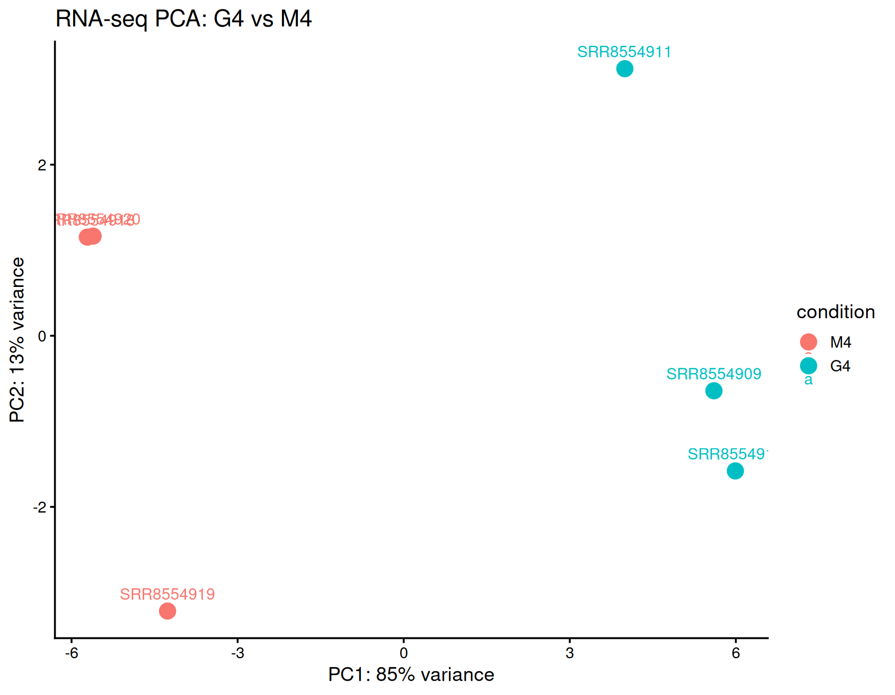
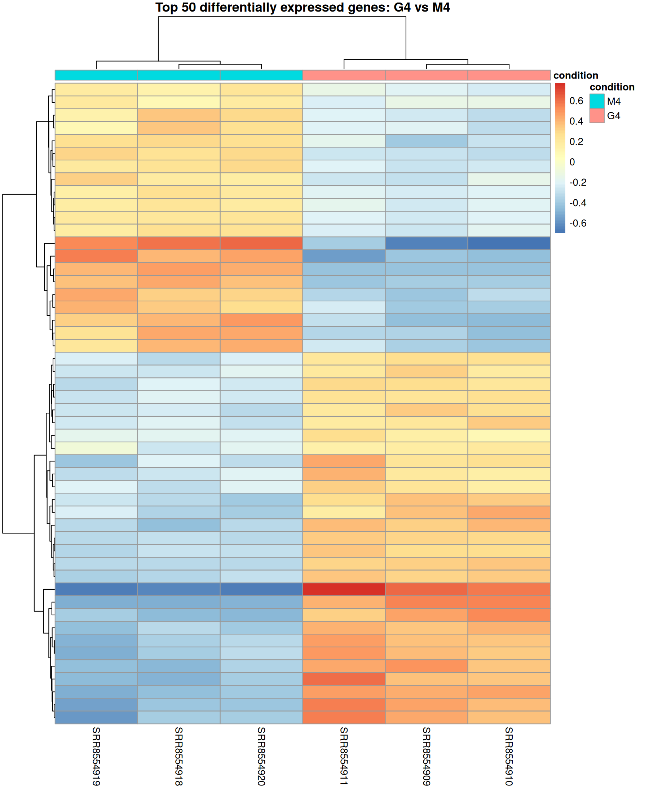
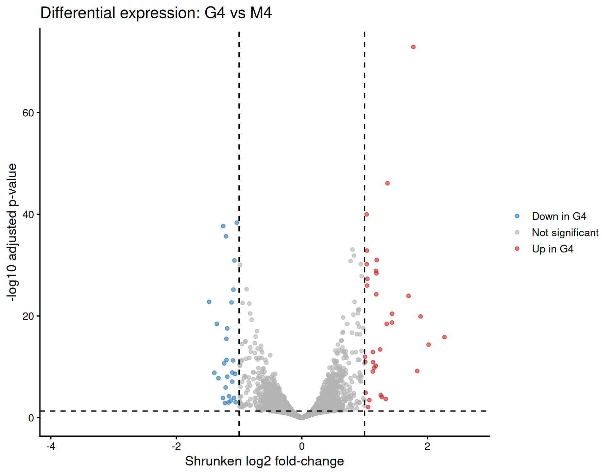
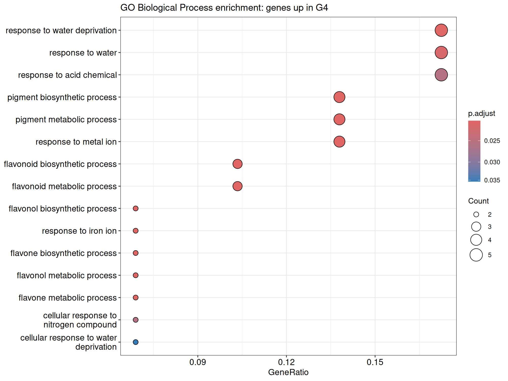

# Public RNA-seq re-analysis: G4 vs M4

## Dataset

This analysis reprocesses six public paired-end Illumina RNA-seq libraries from *Arabidopsis thaliana* seedlings in [GEO series GSE126331](https://www.ncbi.nlm.nih.gov/geo/query/acc.cgi?acc=GSE126331).

The experiment includes three biological replicates per condition:

- **M4**: solvent control, 4 hours
- **G4**: 5 µM GR244DO treatment, 4 hours

The original study used 10-day-old Col wild-type seedlings and Illumina HiSeq 2000 sequencing.

## Reproducible workflow

The samples were processed with this repository's Nextflow pipeline:

1. FastQC quality control
2. fastp paired-end trimming
3. STAR alignment against TAIR10
4. samtools alignment QC and BAM indexing
5. featureCounts gene-level quantification
6. DESeq2 differential expression analysis
7. Gene Ontology Biological Process enrichment

The differential expression design was `~ condition`, with the contrast **G4 vs M4**.

## Differential expression results

| Metric | Result |
|---|---:|
| Biological replicates | 3 M4 + 3 G4 |
| Genes tested after filtering | 22,540 |
| Significance threshold | adjusted p-value < 0.05 and abs(log2FC) >= 1 |
| Significant DEGs | 60 |
| Up-regulated in G4 | 33 |
| Down-regulated in G4 | 27 |

A positive log2 fold-change denotes higher expression in G4.

## Quality and sample structure

PC1 explains 85% of the transformed expression variance and clearly separates M4 from G4. PC2 explains 13% of the variance. The G4 replicates show greater within-condition variability, which is reported as a limitation of this exploratory re-analysis.





## Differential expression visualisation



## Functional interpretation

GO Biological Process enrichment among genes up-regulated in G4 highlighted:

- response to water deprivation and water
- response to acid chemicals and metal ions
- pigment biosynthetic and metabolic processes
- flavonoid, flavonol and flavone biosynthesis

No GO Biological Process term passed multiple-testing correction among genes down-regulated in G4.



## Interpretation and limitations

This public-data re-analysis supports an association between G4 treatment and activation of stress-associated responses and secondary metabolism, especially flavonoid-related processes.

These findings are exploratory and should not be interpreted as independent biological validation. The analysis has three replicates per condition, shows greater variability within G4, and uses the selected reference and annotation versions documented in this repository.

## Reproducibility

```bash
docker build -t nf-rnaseq-illumina-deseq2:1.1.1 -f docker/deseq2/Dockerfile .
docker run --rm -v "$PWD":/project -w /project nf-rnaseq-illumina-deseq2:1.1.1 Rscript scripts/deseq2_analysis.R
docker run --rm -v "$PWD":/project -w /project nf-rnaseq-illumina-deseq2:1.1.1 Rscript scripts/go_enrichment.R
```

The complete result tables are generated under `results/deseq2/` and are intentionally excluded from Git because they are reproducible outputs.